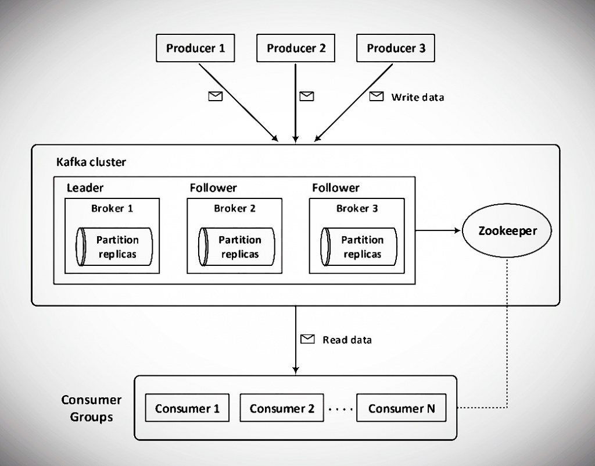

## Micronaut Kafka Sense Hat

Simple example that gets the Sense Hat humidity, pressure and temperature values and send to a Kafka topic using Micronaut.

This code depends on Java Wrapper for Raspberry Pi Sense Hat

- [https://github.com/cinci/rpi-sense-hat-java](https://github.com/cinci/rpi-sense-hat-java)

- [Blog post](http://www.igfasouza.com/blog/kafka-at-the-edge-with-raspberry-pi/)